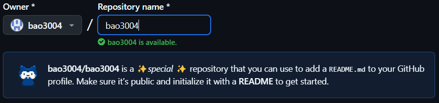

# TẠO 1 PROFILE-GITHUBPAGE

B1: Tạo 1 repo trùng tên với user-id github của bạn và github sẽ thông báo rằng đây là repo đặc biệt.

B2: Tìm 1 repo profile của 1 ai đó trên mạng rồi clone về
B3: thay đổi những đoạn code sao cho phù hợp bạn

### Lưu ý trong file SVG:
- Nếu file svg đang ở dạng ảnh (review) thì chuột phải Open With -> Text Editor
- Ảnh k được import theo kiểu URL mà phải convert sang base64 (dùng tool trên google)

- icon thì lên https://simpleicons.org
### Lưu ý trong file README:
- Đây là 1 đoạn code mẫu của 1 badge, bạn chỉ cần hay đổi nội dung + màu trong link là được 1 badge khác:

&nbsp;
( Hoặc có thể dùng img.shield
)
- Luôn bọc mỗi phần trong 1 
 
 để căn lề