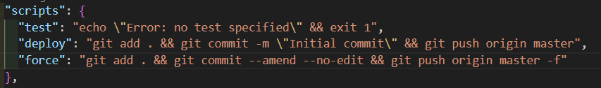

# GITHUB ĐỂ ĐI LÀM
### 1. Các định nghĩa

a. Fork: là quá trình sao chép một repository (dự án) từ tài khoản của người khác vào tài khoản của bạn trên GitHub. Repository được fork sẽ là một bản sao hoàn chỉnh, độc lập với bản gốc, cho phép bạn chỉnh sửa và phát triển mà không ảnh hưởng đến dự án chính.

b. Clone: là quá trình sao chép một repository từ một máy chủ (ví dụ: GitHub, GitLab, Bitbucket) về máy tính local của bạn. Khi bạn clone, bạn sẽ tải xuống toàn bộ mã nguồn, lịch sử commit và các nhánh của repository để làm việc trên môi trường cục bộ.

c. Branch: Tại sao phải cần tạo nhiều branch khi làm việc trong 1 project? Sử dụng nhiều branch giúp bạn:
    - Làm việc độc lập trên từng tính năng hoặc lỗi.
    - Giữ cho nhánh chính luôn ổn định.
    - Tránh xung đột code khi làm việc nhóm.
    - Dễ dàng thử nghiệm mà không làm ảnh hưởng đến dự án chính.

d. Pull request: yêu cầu người quản lý dự án hoặc nhóm phát triển xem xét, thảo luận và hợp nhất (merge) các thay đổi từ nhánh của bạn vào nhánh chính.

### 2. Các câu lệnh ít dùng:
> git log -oneline -n5 : hiển thị lịch sử 5 commit gần nhất trong Git.
> clear: dọn sạch terminal

### 3. Các trường hợp và lệnh dùng nhiều nhất:

a. Remote và branch:
>> git init: tạo một thư mục ẩn .git trong thư mục hiện tại, biến nó thành một Git repository.

>> git clone [repo-link]: clone toàn bộ code repo trên git về máy local.

>> git remote -v: liệt kê tất cả các remote repository được liên kết với repository Git hiện tại và hiển thị URL của chúng; fetch là URL lấy dữ liệu, push là URl đẩy dữ liệu.

>> git remote add [tên_tự_chọn] [URL]: thêm một remote khác để cập nhật từ repository gốc (2 repo trong 1 dự án).

>> git checkout -b [branch_name]:tạo một nhánh mới và chuyển sang nhánh đó ngay lập tức.

>> git switch [branch_name]: chuyển đế nhánh khác (nhánh đã tồn tại).

>> git branch: kiểm tra danh sách các nhánh, nhánh hiện tại sẽ được đánh dấu bằng dấu *

>> git branch -D [branch_name]: xóa một branch trong local repository một cách bắt buộc (Dọn dẹp các nhánh không còn sử dụng).

b. Pull & Push code lên github

- Push lần đầu
>> git add .
>> git commit -m "First-time-commit": commit lần đầu
>> git push origin [branch_name]
- Push các lần sau
>> git commit --amend: từ lần 2 trở đi để tránh sinh ra nhiều commit rác trên github (Chỉnh sửa commit cuối cùng thay vì tạo commit mới).
>> git push origin [branch_name] -f: force ghi đè các commit trên remote bằng commit của bạn từ local (nên cẩn thận).

- Pull
>> git pull origin [branch_name]: Lấy tất cả thay đổi từ remote repository về local và hợp nhất với nhánh hiện tại.

c. Tạo script trong packet.json để dùng code terminal nhanh hơn:
>> npm init -y: khởi tạo file packet.json (nếu chưa có)
Tại mục script thêm các đoạn code bạn muốn làm gọn và đặt tên cho nó:
Ví dụ:

>> npm run [name]: chạy đoan code này tùy bạn sử dụng npm hay yarn để hoàn thành

<h2 style="color:red">* Lưu ý:</h2>

- GitHub sử dụng UTC timezone, . Vì vậy, nếu bạn commit sau 19:00 giờ (giờ VN - UTC +7), GitHub mới có thể ghi nhận vào ngày hôm sau.
- Nếu muốn trang web hoạt động khi upload trang web html/css thì fil index.html phải nằm ở ngoài thư muc gốc thì Github Pages mới hoạt động.

